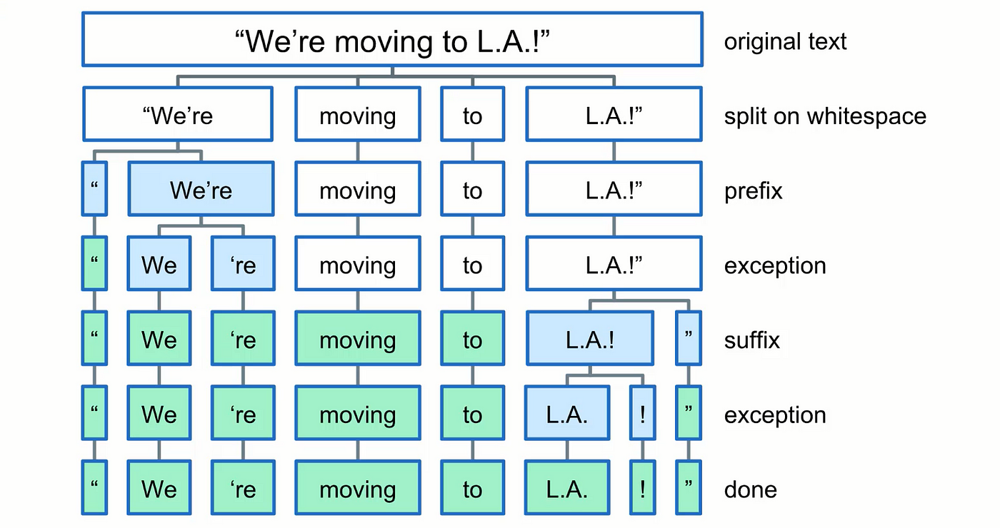

# Text Preprocessing for Natural Language Processing (NLP)

## Overview
This folder contains materials that accompany the Medium post "[Understanding Text Preprocessing in Natural Language Processing (NLP)](https://medium.com/@florvela/understanding-text-preprocessing-in-natural-language-processing-nlp-fba6f53f5b47)".

Text preprocessing is an essential step in NLP to transform raw text data into a clean and structured format that can be efficiently processed by machine learning algorithms.


## Theory

### Tokenization
Tokenization is the process of splitting text into individual words or terms. It simplifies the text into manageable pieces.

**Example**: 
```
Input: "NLP is fascinating."
Output: ["NLP", "is", "fascinating"]
```



### Punctuation Removal
Removing punctuation marks from the text helps in reducing noise and complexity.

### Numbers Removal
Removing numbers unless they carry significant meaning helps in focusing on the text data.

### Special Characters Removal
In many cases, text data contains HTML tags or special symbols (e.g., &amp;, @, #). Removing these elements helps in cleaning the text, making it more suitable for analysis.

### Stop Words Removal
Stop words are common words (e.g., "and", "the") that do not contribute much to the meaning of the text and are often removed.

### Stemming
Stemming involves reducing words to their root form, which may not always be a dictionary word. 

For example, “running” and “runner” might both be reduced to “run”. 

Although this approach is simple, it can sometimes produce non-existent words.

**Example**: 
* “running” -> “run”
* “runners” -> “runner”
* “studies” -> “studi”

### Lemmatization
Lemmatization reduces words to their base or dictionary form, ensuring meaningful root words, maintaining semantic meaning.

**Example**: 
* “running” -> “run”
* “runners” -> “runner”
* “studies” -> “study”


## Resources

- [NLTK Documentation](https://www.nltk.org/)
- [spaCy Documentation](https://spacy.io/)

## Authors

- [Florencia Vela](flor.p.vela@gmail.com)