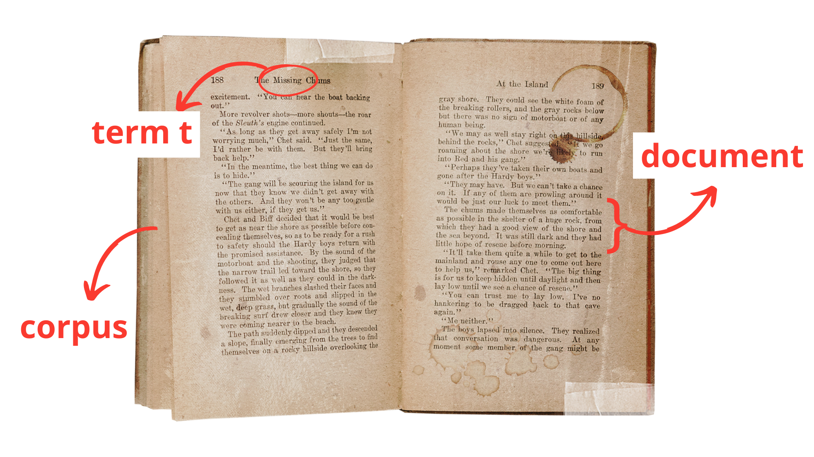
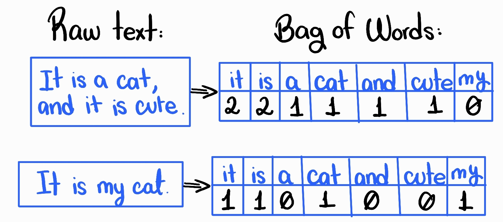
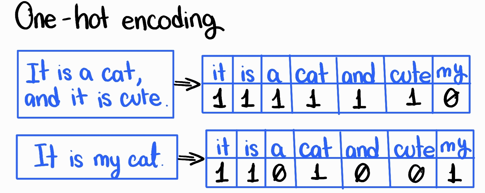
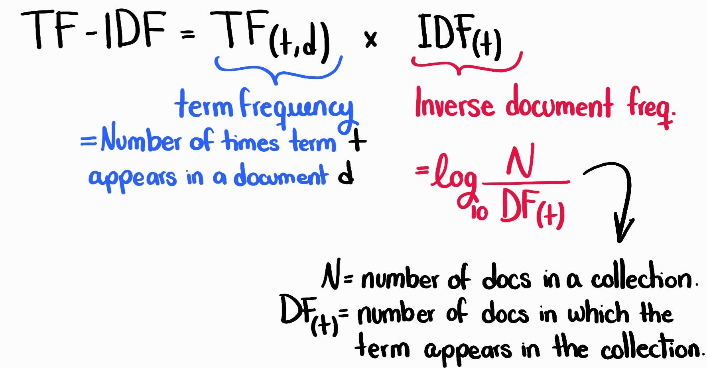
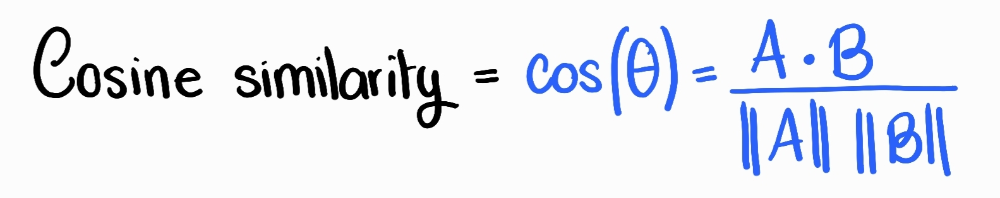

# Introduction to Word Vectorization and Cosine Similarity in NLP

This repository contains Jupyter notebooks that accompany the Medium post "[Introduction to Word Vectorization and Cosine Similarity in NLP](https://medium.com/@florvela/making-nlp-easy-simple-techniques-for-word-vectorization-and-cosine-similarity-e6ef94586f71)". It aims to provide practical examples and detailed explanations of various word vectorization techniques and the use of cosine similarity in Natural Language Processing (NLP).

## Repository Contents

- **notebooks/**
  - `01_one_hot_encoding.ipynb`: Demonstrates one-hot encoding.
  - `02_tf_idf.ipynb`: Explains and calculates TF-IDF.
  - `03_cosine_similarity.ipynb`: Computes cosine similarity between vectors.

## Topics Covered

1. **Introduction to Word Vectorization**: Understand the importance of converting words into numerical vectors.
2. **One-Hot Encoding**: Learn the basics of this simple vectorization method.
3. **TF-IDF Explanation**: Dive into a more advanced technique that weighs terms by their importance across documents.
4. **Cosine Similarity in NLP**: Measure the similarity between documents using their vector representations.

## Understanding Key Concepts: Document, Term, and Corpus

Before diving into the various methods of word vectorization, it’s essential to understand some fundamental concepts in Natural Language Processing: document, term, and corpus.

### Document

A document in NLP refers to any piece of text under analysis. This could be an individual sentence, a paragraph, an article, or even an entire book. Essentially, a document is the basic unit of text that is processed by an NLP system. For instance, in the context of analyzing customer reviews, each review would be considered a separate document.

### Term

A term is a unique word or token within a document. It is the smallest unit of meaning and is used to construct the vectors in various NLP techniques. For example, in the sentence “The cat sat on the mat,” the words “the,” “cat,” “sat,” “on,” and “mat” are all terms. In some cases, terms can also include phrases or n-grams, which are contiguous sequences of n words.

###Corpus

A corpus is a large and structured set of texts, often collected for the purpose of analyzing and building NLP models. It can consist of hundreds, thousands, or even millions of documents. The corpus provides the context and statistical background needed to understand and interpret individual documents and terms. For example, a corpus of news articles might be used to train a model to understand journalistic language and terminology.

## Introduction to Word Vectorization

### What is Word Vectorization?

Word vectorization, also known as word embedding, is the process of transforming words into fixed-size continuous-valued vectors. These vectors capture semantic meaning and syntactic relationships between words in a high-dimensional space. The magic lies in how these vectors represent words: similar words have similar vector representations, allowing algorithms to process and understand language more effectively.

### Methods of Word Vectorization

#### Bag of Words (BoW)

Represents text by the count of each word’s occurrence. While simple, BoW fails to capture word order and semantic meaning.

#### One-hot Encoding

It is one of the simplest forms of word vectorization. In this method, each word in a vocabulary is represented as a unique vector with all zeros except for a single one in the position corresponding to that word.

#### TF-IDF (Term Frequency-Inverse Document Frequency)

It emerged as a more efficient way to represent words. It adjusts word counts by their importance across documents, giving more weight to rare but informative words.

## Cosine Similarity

Cosine similarity is a metric used to measure how similar two vectors are, irrespective of their magnitude. In the context of Natural Language Processing (NLP) and word vectorization, cosine similarity is often used to determine the similarity between two text documents or two terms within a document corpus.

### Why Use Cosine Similarity?

* Magnitude Independence: It focuses on the orientation of the vectors rather than their magnitude, making it robust to variations in document length and word frequency.
* Normalization: It naturally normalizes the vectors, making it suitable for comparing documents of different sizes.
* Interpretability: The cosine of the angle provides an easily interpretable measure of similarity.