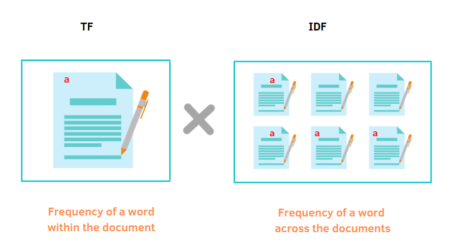
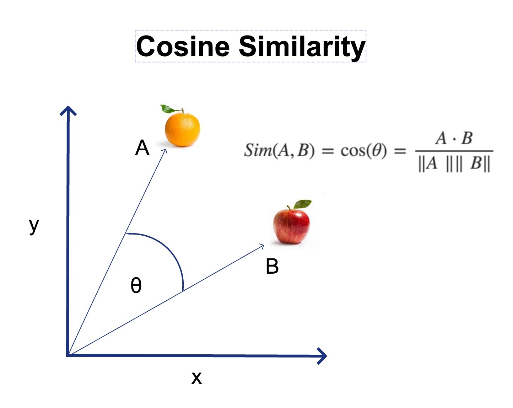

# Natural Language Processing

Repositorio de la materia de Procesamiento de Lenguaje Natural de CEIA - Cohorte 5. 2022

## Word Vectorization

Word Embeddings or Word vectorization is a methodology in NLP to map words or phrases from vocabulary to a corresponding vector of real numbers which used to find word predictions, word similarities/semantics. The process of converting words into numbers are called Vectorization.

In this  we cover:
* Corpus' vocabulary
* TF-IDF
* Cosine similarity

## Simple chatbot

Basic bot that answers covid questions with DNN and Spacy.

## Word Embeddings

Creation of Custom Embeddings with Gensim

## Predict Next Word

Predict the next word in a text.

The model is trained with Charles' Dickens' books, using:
* Bidirectional LSTM layers 
* Many-to-one architecture

## Sentiment analysis with Embeddings + LSTM

Use reviews of clothing buyers to determines the evaluation of the buyer and their criticism (how many stars are assigned to the product).

## QA bot

Use a dataset with conversations in English to build a bot to answer the user's questions. 

Using:
* LSTM
* Fasttext Embeddings

